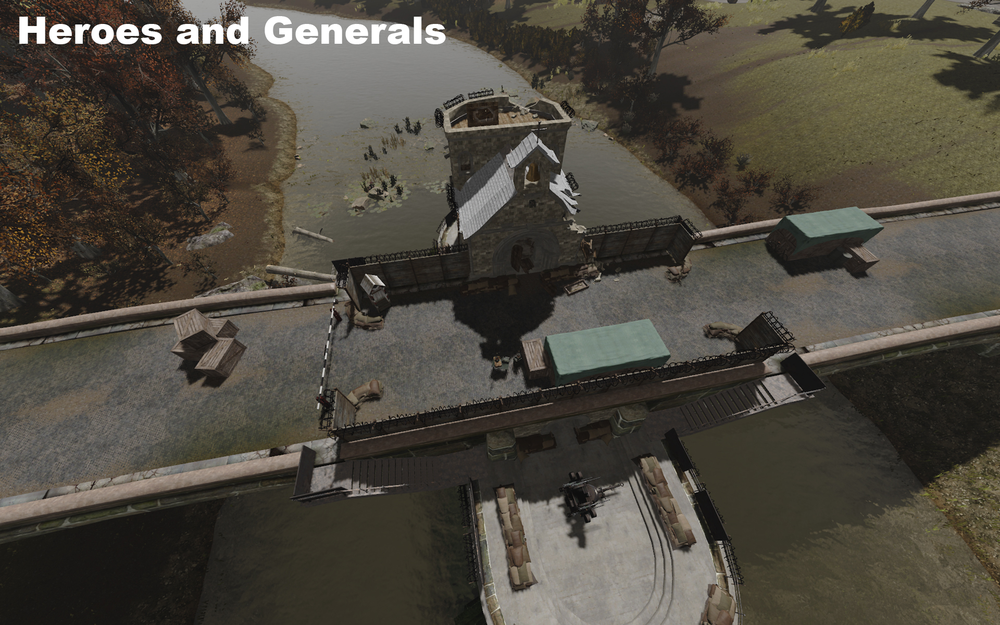
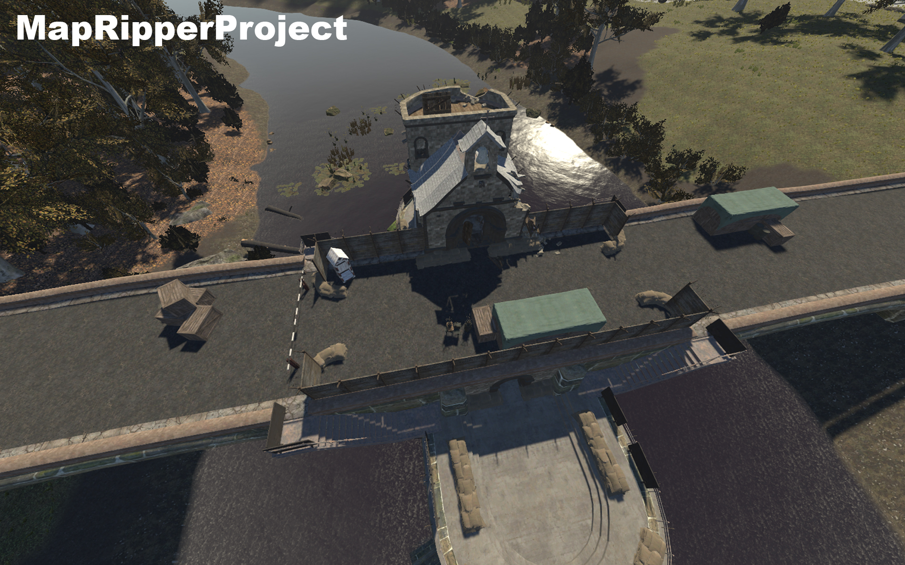

# MapRipperProject - Heroes and Generals - 2016
MapRipperProject is a Unity game engine project that contains recreated maps from the game Heroes and Generals, released in 2016. It is aimed ONLY at recreating maps, NOT the entire game! The project will act as a library that can be ported to other games or game engines.

Notice: Maps are recreated and don't have 100% accuracy, although it is really close and possibly the best you can achieve right now.

# Unity Engine
Since the project is using Unity engine to assemble the maps, it is important to download Unity 6 (6000.0.24f1) beforehand.

Notice: Choice of game engine doesn't matter because it is used as a base for assembling Heroes and Generals maps together (terrains, models, textures).
# Thanks:
- Tier 1: Hisatshi
- Tier 2: Beng_, BluRay, Drakhma, Elkkut, Greger, PCEumel, Peterking2000, Shurenberg, Surya_AI, ÿ.
- Tier 3: phillocos, Setpopa, somuee, SaFty, Tapeworm, xJuliussx
